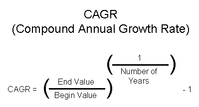

## Chapter 2 파이썬 프로그래밍
### 2.1 파이썬 특징
- 간결한 코드
- 풍부한 표준 라이브러리
- 직관적인 문법
  - 동일한 기능을 한 가지 방식으로 처리하는 것을 선호
  - [PEP 8](https://peps.python.org/pep-0008/)
### 2.2 파이썬 설치
#### 2.2.1 64비트 파이썬 설치
#### 2.2.2 pip를 이용한 패키지 설치
- 설치된 모든 패키지 목록
```
pip list
```
- 설치한 패키지 목록
```
pip freeze > requirements.txt
```
- 패키지 설치
```
pip install -r requirements.txt
```
#### 2.2.3 32비트 파이썬 가상화(venv) 설치
#### 2.2.4 아나콘다 배포판에 대해
### 2.3 문자열과 산술연산
#### 2.3.1 문자열
- str 문자열 클래스
```
type('hello python')
```
- 이스케이프 문자
  - ` \ `(백슬러시)로 시작
  - 문자열 그래도 표시하고 싶을때는 문자열 앞에 r 추가
  ``` 
  print(r'c:\Windows\System32') 
  ```
  - 작은따옴표나 큰따옴표 표시
  ```  
  print('\"It\'s not that I\'m so smart"') 
  print('''"It's not that I'm so smart"''')
  ```
  - 여러 줄에 걸친 문자열
  ``` 
  print('''Hello World,
  Pythonic~
  ''') 
  ```
- 인덱싱
``` 
word = 'Python'
len(word)
print(word[0] + word[1] + word[2] + word[3] + word[4] + word[5])
print(word[-6] + word[-5] + word[-4] + word[-3] + word[-2] + word[-1])
```
- 슬라이싱
  - 인덱스와 :(클론)을 이용하여 문자열의 특정 부분을 잘라낼 수 있음
  ```
  word = 'Python'
  print(word[0:6])
  print(word[0:])
  print(word[:6])
  print(word[:-1])
  ```
#### 2.3.2 산술 연산
- ` +, -, *, /, //, **, % ` 등 지원
- ` ++, -- ` 지원 암함
- 연산자 우선순위
  - 우선순위가 제일 높은 연산자는 `괄호`다
#### 2.3.3 흐름 제어
- if 조건문
  - if, elif, else 조합
  ``` 
  rsi = 88
  if rsi > 70:
    print('RSI', rsi, 'means overbought.')
  elif rsi < 30: 
    print('RSI', rsi, 'means oversold.')
  else:
    print('...')
  ```
- for 반복문
  - 열거형 객체
  ``` 
  for i in [1, 2, 3]:
      print(i) 
  ```
  - range() 함수
  ``` 
  for i in range(1, 7, 2):
      print(i)
  ```
  - enumerate() 함수
  ``` 
  FAANG = ['FB', 'AMZN', 'AAPL', 'NFLX', 'GOOGL']
  for idx, symbol in enumerate(FAANG, 1):
    print(idx, symbol)
  ```
- while 반복문
  - for 반목문은 while 반복문으로 대체 가능
  - while else와 for else
    - else 문을 같이 쓰면 반복을 종료하고 특정 문장 실행
    - break문에 의해 종료시 실행되지 않음
    ``` 
    i = 0
    while i >= 0:
        i += 1
        if not (i % 2):
             continue
        if i > 5:
            break
        print(i)
    else:
        print('Condition is false')
    ```
- try except 예외 처리
  - 예외로 인한 프로그램의 종료를 막을 수 있음
  ``` 
  try:
    1/0
  except Exception as e:
    print('Exception occured : ', e) 
  ```
### 2.4 반복 자료형
- interables
  - list
  - tuple
  - set
  - dictionary
#### 2.4.1 리스트
- 원소들은 동일한 자료형이 아니어도 됨
``` 
ls = ['one', 'two', 'three', 4, 5, 6]
ls = list(['one', 'two', 'three', 4, 5, 6])
```
- 다른 반복 자료형도 원소로 포함 가능
``` 
L = [[1,2], [3,4]]
print(L[0])
print(L[1])
print(L[0][0])
print(L[0][1])
print(L[1][0])
print(L[1][1])
```
- 덧셈 연산자를 이용한 리스트 추가
``` 
L = [[1,2], [3,4]]
print(L + L)
```
- 곱셈 연산자를 이용한 리스트 반복
``` 
L = [[1,2], [3,4]]
print(L * 3)
```
- split() 함수
  - 문자열을 분리할 때 사용
  ``` 
  myList = 'Thoughts become things.'.split()
  print(myList) 
  ```
- join() 함수
  - 리스트를 인수로 받아서 하나의 문자열로 반환
  ``` 
  myList = ['Thoughts', 'become', 'things.']
  ' '.join(myList) 
  ```
- sort()와 sorted()
  - sort() 
    - 리스트를 직접 정렬
    - None을 반환
    ``` 
    li = [1,2,3,4,5]
    li.sort()
    print( li ) 
    ```
  - sorted()
    - 반복 가능한 자료형에 사용 가능
    - 새로운 객체로 리턴
    ``` 
    li = [5,2,3,4,1]
    print( sorted(li) )
    print( li ) 
    ```
- append()와 extend()
  - append() 
    - 인수의 자료형에 상관 없이 리스트 뒤에 그대로 추가
    ``` 
    L = [1,2]
    L.append([3,4])
    print(L) 
    ```
  - extend()
    - 인자로 반복 자료형이 들어와야함
    - 인자로 들어온 반복 자료형 내부의 각 원소를 리스트에 추가
    ``` 
    L = [1,2]
    L.extend([3,4])
    print(L) 
    ```
- 구분자 변경하기
  - split() 과 join() vs replace()
  ``` 
  '-'.join('2012/01/04'.split('/'))
  '2012/01/04'.replace('/', '-')
  ```
- 천 단위 숫자를 쉼표로 구분하기
  - 쉼표 제거하기
  ``` 
  ''.join('1,234,567,890'.split(','))
   '1,234,567,890'.replace(',', '')
  ```
  - 쉼표 추가하기
  ```angular2html
  format(1234567890, ',')
  ```
- 리스트 복사
  - [:] 사용
  ``` 
  myList = ['Thoughts', 'become', 'things.']
  newList = myList[:]
  print(newList) 
  ```
- 리스트 내포(comprehension)
  - 열거형 객체의 전체 또는 일부 원소를 변경하여 새로운 열거형 객체 생성
  - for문 이용 
  ``` 
  nums = [1,2,3,4,5]
  squares = []
  for x in nums:
    squares.append(x**2)
  print(squares)  
  ```
  - comprehension 기능 이용
  ``` 
  nums = [1,2,3,4,5]
  squares = [x**2 for x in nums]
  print(squares)
  even_squares = [x**2 for x in nums if x%2==0]
  print(even_squares) 
  ```
#### 2.4.2 변경이 불가능한 튜플
- 다양한 자료형의 원소를 가질 수 있음
- 소괄호로 표시
``` 
myTuple = ('a', 'b', 'c', [10, 20, 30], abs, max)
print(myTuple[3])
print(myTuple[4](-100))
print(myTuple[5](myTuple[3]))
```
- 원소를 변경할 수 없음
``` 
myTuple = ('a', 'b', 'c', [10, 20, 30], abs, max)
myTuple[0] = 'd'
```
#### 2.4.3 {키:값} 형태 딕셔너리
- 키와 값을 하나의 원소로 가지는 순서가 없는 집합
  - 인덱스 숫자로 접근 안됨
  ``` 
  crispr = {'EDIT': 'Editas Medicine', 'NTLA': 'Intellia Therapeutics'}
  # crispr[1]
  print(crispr['NTLA'])
  ```
  - 원소 추가
  ``` 
  crispr = {'EDIT': 'Editas Medicine', 'NTLA': 'Intellia Therapeutics'}
  crispr['hello'] = 'world'
  print(crispr['hello'], len(crispr) 
  ```
#### 2.4.4 문자열 포맷 출력
- ` % ` 기호 방식
``` 
crispr = {'EDIT': 'Editas Medicine', 'NTLA': 'Intellia Therapeutics'}
for x in crispr:
  print('%s : %s' % (x, crispr[x])
```
- ` {} ` 기호 방식
``` 
crispr = {'EDIT': 'Editas Medicine', 'NTLA': 'Intellia Therapeutics'}
for x in crispr:
  print('{} : {}'.format(x, crispr[x]))
```
- f-strings 방식
``` 
crispr = {'EDIT': 'Editas Medicine', 'NTLA': 'Intellia Therapeutics'}
for x in crispr:
  print(f'{x} : {crispr[x]}')
```
- 문자열 포맷별 출력 비교표
  - 84p 참조
  - f-strings 방식이 가장 최신이며 가장 빠름
  ``` 
  s = 'STRING'; f'{s.lower()}
  f'{0x41:c}'
  f'{0xFF00+0x00FF:d}'
  f'{3.141592:.2f}'
  f'{65535:x}'
  f'{65535:X}'
  f'{12345:,d}'
  ```
#### 2.4.5 중복 없는 셋
- 중복이 없는 원소 집합
- 원소의 순서를 보장하지 않음
- 원소의 존재 여부 검사속도가 빠름
- 인덱싱 접근이 안되는 대신 교집합, 합집합, 차집합을 구할 수 있음
- 리터럴로 원소가 없는 상태에서 생성할 수 없음
``` 
ls = [] # list
d = {} # dictionary
t = () # tuple
s = set() # set
```
- 셋을 이용한 리스트 중복 원소 제거
``` 
ls = [1,3,5,2,2,1,2,3,4,9]
print(list(set(ls))) 
```
#### 2.4.6 타임잇으로 성능 측정하기
- timeit(테스트 구문, setup=테스트 준비 구문, number=테스트 반복 횟수)
- 순회 속도 비교하기(비슷함)
```
import timeit
iteration_test = """
for i in itr :
  pass
"""
timeit.timeit(iteration_test, setup='itr = list(range(10000))', number=1000)
timeit.timeit(iteration_test, setup='itr = tuple(range(10000))', number=1000)
timeit.timeit(iteration_test, setup='itr = set(range(10000))', number=1000) 
```
- 검색 속도 비교하기(set이 가장 빠름)
``` 
search_test = """
import random
x = random.randint(0, len(itr)-1)
if x in itr:
  pass
"""
timeit.timeit(search_test, setup='itr = list(range(10000))', number=1000)
timeit.timeit(search_test, setup='itr = tuple(range(10000))', number=1000)
timeit.timeit(search_test, setup='itr = set(range(10000))', number=1000) 
```
### 2.5 변수와 함수
#### 2.5.1 변수
- 데이터
  - 컴퓨터에서 처리하는 값
- 자료형
  - 데이터의 종류
- 파이썬에서는 변수를 선언할 때 자료형을 지정하지 않음
- 전역 변수와 지역 변수
  - 변수의 유효 범위에 따라 나뉨
- 내장 객체와 자료형
  - type() 함수를 통해 변수형 확인
- 제한 없는 정수형
  - 큰 수 처리가능
- dir() 함수
  - 셸에서 사용할 수 있는 객체가 표시
  ``` 
  s = 'hello'
  dir(s) 
  ```
- 예약어
  - 변수명은 영문자 또는 밑줄 시작
  - 변수명으로 사용할 수 없는 단어
  ``` 
  help('keywords') 
  ```
#### 2.5.2 함수
- 특정 기능을 수행하는 코드
- 들여쓰기
  - 예약어 def를 사용하여 정의
  - 구현내용은 반드시 들여쓰기 되어져 있어야 함
- 연평균 성장률(CAGR) 구하기
  - 
  ``` 
  def getCAGR(first, last, years):
    return (last/first)**(1/years) - 1
  cagr = getCAGR(65300, 2669000, 20)
  print(f'SEC CAGR : {cagr*100:.2f}')
  ```
- None 반환값
  - NoneType 클래스의 객체
  ``` 
  def func1():
    pass
  def func2():
    return
  def func3():
    return None
  ```
- 함수, 프로시저, 메서드
  - 함수
    - 클래스에 속하지 않는 함수
  - 메서드
    - 클래스에 속하는 함수
- 여러 결과값으로 반환
  - 여러 결과값을 한꺼번에 반환가능
    - 튜플 객체로 변환
- 람다
  - ` lambda 인수 : 표현식 ` 으로 사용
  ``` 
  insertComma = lambda x: format(x, ',')
  insertComma(1234567890)
  ```
- [내장 함수 리스트](https://github.com/INVESTAR/StockAnalysisInPython/blob/master/10_Appendix_(Python_Built-in_Functions_and_AES-256_Encryption).pdf) 
### 2.6 모듈과 패키지
#### 2.6.1 모듈
- .py 확장자를 갖는 파일
- 파일명에서 .py 확장자를 제외한 파일명이 모듈명
  - __name__ 속성에 저장
- 변수, 함수, 클래스를 포함
- help() 함수
  - help('modules')
    - 현재 PC에 설치된 모듈 목록
  - help('모듈명')
    - 해당 모듈에 대한 상세 설명 표시
- import
  - 다른 모듈에 정의된 변수, 함수, 클래스를 불러올 수 있음
  ``` 
  import 모듈명
  import 패키지명.모듈명 
  ```
- ` __file__ ` 속성
  - 모듈이나 패키지의 실제 파일 위치
  ``` 
  import keyword
  keyword.__file__ 
  ```
- from ~ import ~
  - from 다음에 지정한 패키지명이나 모듈명 생략 가능
  ``` 
  from 모듈명 import 클래스명, 함수명
  from 패키지명 import 모듈명 
  ```
  ``` 
  import calendar
  print(calendar.month(2020, 1))
  ```
  ``` 
  from calendar import month
  print(month(2020, 1))
  ```
- import ~ as ~
  - 별칭 사용
  ``` 
  import 모듈명 as 별칭
  from ~ import ~ as 별칭 
  ```
  ``` 
  import datetime
  print(datetime.datetime.now())
  ```
  ``` 
  from datetime import datetime as dt
  print(dt.now())
  ```
#### 2.6.2 패키지
- 여러 모듈을 특정 디렉터리에 모아 놓은 것
- 패키지의 경로 속성
  - 특별한 형태의 모듈
  - 모든 패키지는 모듈이지만 모든 모듈은 패키지가 아님
  - 경로 속성을 갖는 것들만 패키지
- 패키지 생성하기
  - ex) myPackage 디렉터리 생성
  - 디렉터리 안에 moduleA.py와 moduleB.py 파일 생성
  ``` 
  # moduleA.py
  def functionA():
    print('FUNCTION_A')
  print('MODULE_A :', __name__) 
  ```
  ``` 
  # moduleB.py
  def functionB():
    print('FUNCTION_B')
  print('MODULE_B :', __name__) 
  ```
- `__name__` 속성
  - python 명령어를 이용 했을때 모듈명은 ` main `으로 나옴
  - import를 이용했을 경우 `myPackage.moduleA`로 나옴
- `__pycache__` 디렉터리
  - 임포트 하는 순간 모듈 디렉터리 안에 `.pyc` 컴파일 파일 자동 생성
  - 다음번 사용시 컴파일 작업 없이 사용 가능
- `__init__.py`
  - 패키지 초기화 파일
  ``` 
  __all__ = ['moduleA', 'moduleB']
  ```
  - 파이썬 3.3버전부터는 작성하지 않아도 됨
- main() 함수 만들기
``` 
def functionA():
  print('FUNCTION_A')

def main():
  print('MAIN_A :', __name__)
  
if __name__ == '__main__':
  main() 
```
  - python에서 직접 실행시 main() 함수 호출됨
  - import시 main() 함수 호출 안됨
  ``` 
  import myPackage.moduleA
  myPackage.moduleA.main()
  ```
- 파이썬의 선(The Zen of Python)
### 2.7 객체지향 프로그래밍
#### 2.7.1 클래스
- 속성과 메서드로 구성
``` 
class MyFirstClass:
  clsVar = 'The best way to..'
  def clsMethod(self):
    print(MyFirstClass.clsVar + ' Alan')
    print(self.clsVar + ' Alan')
mfc = MyFirstClass()
print(mfc.clsVar)
mfc.clsMethod()
```
#### 2.7.2 상속
- 클래스가 가지는 모든 속성과 메서드를 다른 클래스에게 물려주는 기법
``` 
class 자식_클래스(부모_클래스1, 부모_클래스2, ...):
  pass 
```
- 오버라이딩
  - 메서드를 재정의 하는것
- 오버로딩
  - 인수 형식이 다른 여러 메서드를 작성하는 것
#### 2.7.3 클래스 변수와 인스턴스 변수
- 클래스 변수
  - 클래스 내부에 존재하면서 메서드 밖에 정의된 변수
- 인스턴스 변수
  - 메서드 내부에서 정의
  - 변수명 앞에 self가 붙음
  - 해당 인스턴스에서만 사용할 수 있음
#### 2.7.4 클래스 메서드
- 클래스 내부에 정의된 함수
- `__init__` 생성자
  - 인스턴스가 생성될 때 자동으로 호출되는 메서드
- `__del__` 소멸자
  - 인스턴스가 메모리에서 제거될 때 자동으로 호출되는 메서드
``` 
class NasdaqStock:
  """Class for NASDAQ stocks"""
  count = 0
  def __init__(self, symbol, price):
    self.symbol = symbol
    self.price = price
    NasdaqStock.count += 1
    print(f'Calling __init__({self.symbol}, {self.price:.2f}) > count: {NasdaqStock.count}')
  def __del__(self):
    print(f'calling __del__({self})')
gg = NasdaqStock('GOOG', 1154.05)
ms = NasdaqStock('MSFT', 102.44) 
del(gg)
del(ms)
```
### 2.8 파일 처리 및 외부 라이브러리 활용
#### 2.8.1 리퀘스트로 인터넷에서 이미지 파일 가져오기
``` 
import requests

url = 'http://bit.ly/2JnsHnT'
r = requests.get(url, stream=True).raw
```
#### 2.8.2 필로로 이미지 보여주기
```
from PIL import Image

img = Image.open(r)
img.show()
img.save('src png')
```
#### 2.8.3 'with ~ as 파일 객체'로 이미지 파일 복사
``` 
BUF_SIZE = 1024
with open('src.png', 'rb') as sf, open('dst.png', 'wb') as df:
  while True:
    data = sf.read(BUF_SIZE)
    if not data:
      break
    df.write(data)
```
#### 2.8.4 SHA-256으로 파일 복사 검증하기
``` 
import hashlib

sha_src = hashlib.sha256()
sha_dst = hashlib.sha256()

with open('src.png', 'rb') as sf, open('dst.png', 'rb') as df:
  sha_src.update(sf.read())
  sha_dst.update(df.read())
  
print(f"src.png's hash : {sha_src.hexdigest()}")
print(f"dst.png's hash : {sha_dst.hexdigest()}")
```
#### 2.8.5 맷플롯립으로 이미지 가공하기
- [소스 실습](../src/02/ImageProcessing.py)