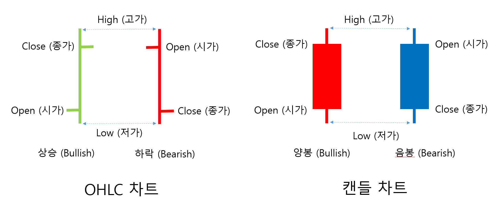

## Chapter 4 웹 스크레이핑을 사용한 데이터 분석
### 4.1 팬더스로 상장법인 목록 읽기
- 한국거래소 기업공시채널 접속(kind.krx.co.kr)
- 상장법인상세정보->상장법인목록에서 Excel 다운로드
### 4.1.1 엑셀 파일 내용 확인하기
- xls 확장자이지만 내용물은 HTML임
  - pandas의 read_html() 함수 이용
### 4.1.2 read_html() 함수로 파일 읽기
- 데이터프레임 객체를 원소로 가지는 리스트를 반환
```
import pandas as pd
krx_pd = pd.read_html('./docs/tmp/상장법인목록.xls')[0]
krx_pd['종목코드'] = krx_pd['종목코드'].map('{:06d}'.format)
krx_pd = krx_pd.sort_values(by='종목코드')
print(krx_pd)
```
  - map() 함수를 이용하여 종목코드 6자리로 변경
    - 인수로 받은 함수를 이용하여 값을 변경
  - sort_values() 함수를 이용하여 정렬
    - 오름차순 정렬이 기본, ascending=False 내림차순
### 4.2 HTML 익히기
#### 4.2.1 HTML 기본 구조
#### 4.2.2 HTML 주요 태그
#### 4.2.3 HTML 예시
### 4.3 웹에서 일별 시세 구하기
#### 4.3.1 네이버 금융 일별 시세 분석하기
#### 4.3.2 소스 코드에서 링크 주소 검색하기
### 4.4 뷰티풀 스프로 일별 시세 읽어오기
- 뷰티풀 스프
  - HTML, XML 페이지로부터 데이터를 추출하는 파이썬 라이브러리
  - 웹 크롤러(Web Crawler), 웹 스크레이퍼(Web Scraper) 로 불림
#### 4.4.1 파서별 장단점
- Python's html parser
  - `html.parser`
- lxml's HTML parser
  - `lxml`
- lxml's XML parser
  - `lxml-xml`, 'xml'
- html5lib
  - `html5lib`
#### 4.4.2 find_all() 함수와 find() 함수 비교
- find_all() 함수
  - `find_all(['검색할 태그'][, class_='클래스 속성값'][, id='아이디 속성값'][, limit=찾을 개수])`
  - 못 찾을 시 빈 리스트 리턴
- find() 함수
  - `find(['검색할 태그'][, class_='클래스 속성값'][, id='아이디 속성값'])`
  - 못 찾을 시 None 반환
#### 4.4.3 맨 뒤 페이지 숫자 구하기
``` 
from bs4 import BeautifulSoup
import urllib.request as request

headers = {'User-Agent':'Mozilla/5.0 (Windows NT 6.3; Win64; x64) AppleWebKit/537.36 (KHTML, like Gecko) Chrome/63.0.3239.132 Safari/537.36'}
url = 'https://finance.naver.com/item/sise_day.naver?code=005380&page=1'
req = request.Request(url, headers=headers)
with request.urlopen(req) as doc:
    html = BeautifulSoup(doc, 'lxml')
    pgrr = html.find('table', class_='Nnavi').find('td', class_='pgRR')
    print(pgrr.a['href'])
    print(pgrr.prettify())
    print(pgrr.text)
    s = str(pgrr.a['href']).split('=')
    print(s[-1])
```
#### 4.4.4 전체 페이지 읽어오기
- [현대차-소스](../src/04/total_page.py)
### 4.5 OHLC와 캔들 차트
- Open-High-Low-Close
- 캔들 차트
  - 250여 년 전 일본 오사카의 상인이 개발
#### 4.5.1 OHLC 차트와 캔들 차트의 비교
  
#### 4.5.2 현대차 종가 차트
- [현대차-종가차](../src/04/close_chart.py)
#### 4.5.3 현대차 캔들 차트
``` 
import mplfinance as mpf
mpf.plot(OHLC 데이터프레임 [, title=차트제목][, type=차트형태][, mav=이동평균선][, volume=거래량 표시여부][, ylabel=y축 레이블]) 
```